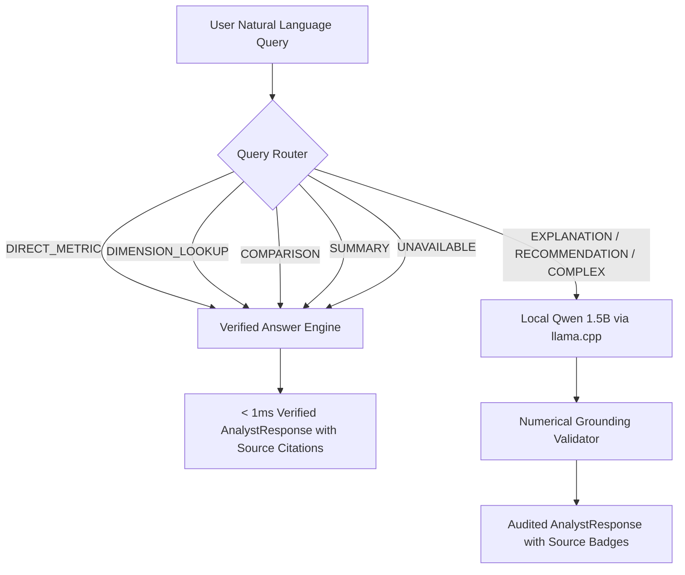

# AI Architecture — User-Data-Aware Local Business Analyst

## 1. Overview & Core Philosophy

The Back-Office AI Copilot is architected around a foundational security and reliability principle:

> **Permanent Model Intelligence is strictly separated from Dynamic User Business Data.**

```
+-----------------------------------------------------------------------------------+
|                              PERMANENT AI LAYER                                    |
|   - Base Model: Qwen 2.5 1.5B Instruct                                            |
|   - LoRA Adapter: business-analyst-v1 (Reasoning, JSON Formatting, Refusals)      |
|   - GGUF Quantization: Q4_K_M (Local llama.cpp runtime)                           |
+-----------------------------------------------------------------------------------+
                                         │
                                         ▼
+-----------------------------------------------------------------------------------+
|                        DYNAMIC LIVE USER BUSINESS DATA                            |
|   - Uploaded CSV / Excel records (Standardized via Schema Matcher)                |
|   - Deterministic Analytics Engine (Metrics, Distributions, Cross-tabs)          |
|   - Canonical Verified Analytics Object (AUTHORITATIVE TRUTH)                     |
+-----------------------------------------------------------------------------------+
```

### Why this architecture?
1. **Zero Data Leakage**: User business data is never fine-tuned into model weights. Your financial figures, employee attrition numbers, and sales margins never enter the model checkpoint.
2. **0% Hallucination on Metrics**: Direct metric queries (counts, averages, sums, rankings) bypass the LLM entirely and are computed deterministically.
3. **Strict Numerical Grounding**: Any analytical claim made by the LLM is programmatically audited against verified dataset facts before being returned to the user.

---

## 2. End-to-End Query Routing & Flow

Incoming user queries are analyzed by the `QueryRouter`:



### 9 Analytical Query Categories
| Query Type | Example Query | Handling Mechanism | Latency |
| :--- | :--- | :--- | :--- |
| `DIRECT_METRIC` | *"How many employees are there?"* | Deterministic lookup from verified metrics | < 1ms |
| `DIMENSION_LOOKUP` | *"Which city has the highest headcount?"* | Deterministic dimension ranking | < 1ms |
| `COMPARISON` | *"Compare Bangalore and Pune"* | Deterministic delta & distribution comparison | < 1ms |
| `SUMMARY` | *"Give me an executive summary"* | Fast deterministic synthesis or guided LLM | Instant |
| `UNAVAILABLE` | *"What is EBITDA?"* (on HR data) | Explicit refusal stating missing variables | < 1ms |
| `EXPLANATION` | *"Why is attrition high in Payment Tier 3?"* | Local LLM with compact authoritative context | ~1-3s |
| `RECOMMENDATION` | *"What should management investigate?"* | Local LLM with domain heuristics | ~1-3s |
| `TREND` | *"What is the joining pattern over time?"* | Deterministic time series + LLM insights | ~1-2s |
| `COMPLEX` | *"Simulate 10% salary increase impact"* | Local LLM reasoning with strict grounding | ~2-4s |

---

## 3. The Canonical Analytics Context

When an uploaded file is ingested, the deterministic analytics engine produces a **Canonical Analytics Context**:

```json
{
  "dataset_id": "emp_4653_hr",
  "profile": "hr",
  "row_count": 4653,
  "column_count": 9,
  "capabilities": ["attrition_analysis", "demographics", "temporal_patterns"],
  "metrics": {
    "employee_count": 4653,
    "average_age": 29.39,
    "attrition_rate": 34.39,
    "employees_left": 1600,
    "employees_retained": 3053
  },
  "dimensions": {
    "city": { "Bangalore": 2228, "Pune": 1268, "New Delhi": 1157 }
  },
  "available_fields": ["Education", "JoiningYear", "City", "PaymentTier", "Age", "Gender", "EverBenched", "LeaveOrNot"]
}
```

This single object powers:
1. **Interactive Dashboard KPIs** (100% synchronized)
2. **Domain Reports & Section Tables**
3. **AI Business Analyst Answers & Verified Badges**

---

## 4. Strict Numerical Grounding Validator

The `GroundingValidator` extracts all numerical values from LLM responses using regular expressions and matches them against the pool of valid numbers:
- Row counts and column counts
- All computed metrics (`metrics.*`)
- Percentage representations (e.g. `34.39` or `0.344`)
- All dimension category counts and percentages
- Standard calendar years (2000–2030)

If the model outputs an ungrounded figure (e.g., *"9,999 applicants"*), the validator:
1. Logs a warning
2. Appends an explicit caveat in the response's `limitations` array:
   > *"Note: Certain figures (9999.0) could not be verified against deterministic analytics. The available verified data does not provide those values."*

---

## 5. Privacy & Data Residency

- **100% On-Premises / Offline Capable**: All local LLM inference runs via `llama.cpp` locally on your machine without external cloud API calls.
- **Zero Third-Party Training**: No user prompts or proprietary records are ever shared or transmitted for model training.
