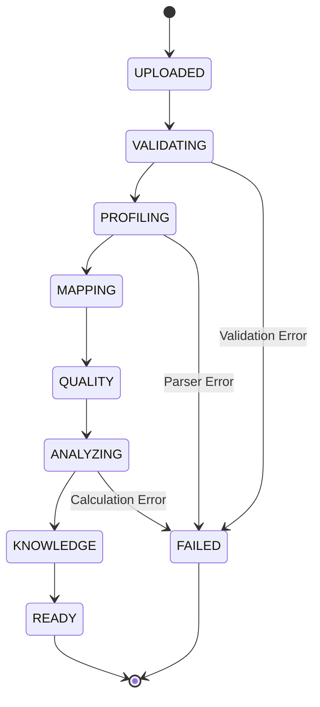

# Novera — Enterprise Data Architecture, Versioning & Lineage

## 1. Core Collections
The authoritative MongoDB database uses the following primary collections:

| Collection | Ownership Scoping | Purpose |
| :--- | :--- | :--- |
| `accounts` | Global / Tenant Root | Tenant organizational metadata and plan limits. |
| `users` | `account_id` | User identity, credentials (hashed), roles, and settings. |
| `workspaces` | `account_id` | Operational workspace groupings within an account. |
| `workspace_members` | `account_id`, `workspace_id` | Association between users and workspace roles. |
| `datasets` | `account_id`, `workspace_id` | Registered dataset metadata, current version, schema profiles. |
| `dataset_versions` | `account_id`, `workspace_id` | Immutable snapshots of dataset schema, row counts, and checksums. |
| `dataset_schemas` | `account_id` | Inferred semantic schema, data types, and quality issues. |
| `dataset_knowledge` | `account_id` | Semantic memory, synonyms, metrics, dimensions, query rules. |
| `mappings` | `account_id` | Column standardization and field mapping definitions. |
| `reports` | `account_id`, `workspace_id` | Generated MIS reports, pinned dataset version, content, status. |
| `report_versions` | `account_id`, `workspace_id` | Immutable historical snapshots of generated reports. |
| `report_ai_summaries`| `account_id` | Grounded executive summaries with prompt and validation metadata. |
| `conversations` | `account_id`, `workspace_id` | AI Analyst chat sessions scoped to dataset and user. |
| `messages` | `account_id`, `conversation_id` | Analyst message exchanges, tool plans, and responses. |
| `processing_jobs` | `account_id`, `workspace_id` | Background processing pipeline state machines and progress. |
| `activities` | `account_id`, `workspace_id` | End-user product activity log for dashboard display. |
| `audit_logs` | `account_id`, `workspace_id` | Immutable compliance and security event trail. |

---

## 2. Dataset Processing Pipeline State Machine
Background data processing follows an atomic, staged lifecycle:



### 2.1 Stale Job Recovery
If an ungraceful shutdown occurs while a job is in `PROCESSING` state:
- Heartbeats (`heartbeat_at`) older than 300 seconds trigger automatic transition to `FAILED` with `failure_code: "STALE_JOB_TIMEOUT"`.
- Prevents UI spinners from remaining permanently hung.

---

## 3. Data Lineage & Reproducibility
Every analytical report and AI summary preserves complete lineage:
```
Dataset (ds_abc)
  └── Dataset Version 2 (12,400 rows, checksum: sha256_...)
        └── Mapping Version 1 (Standardized Schema)
              └── Deterministic Analytics v1 (Total Revenue: $5.02M)
                    └── Report Version 1 (rep_xyz)
                          └── AI Grounded Summary (prompt_v6.6.0, verified claims: 8)
```
If Dataset Version 3 is subsequently uploaded, historical reports remain permanently pinned to Version 2.

---

## 4. Indexing Strategy for Tenant Isolation & Speed

1. **Compound Multi-Tenant Keys**:
   - `datasets`: `[("account_id", 1), ("created_at", -1)]`, `[("dataset_id", 1)]`
   - `reports`: `[("account_id", 1), ("dataset_id", 1), ("dataset_version", 1)]`
   - `processing_jobs`: `[("account_id", 1), ("created_at", -1)]`, `[("status", 1), ("heartbeat_at", 1)]`
   - `audit_logs`: `[("account_id", 1), ("created_at", -1)]`, `[("account_id", 1), ("action", 1)]`
   - `dataset_versions`: `[("dataset_id", 1), ("dataset_version", 1)]`, `[("account_id", 1)]`
2. **Safe Index Execution**:
   - All indexes are safely created via `init_indexes()` upon application startup.
